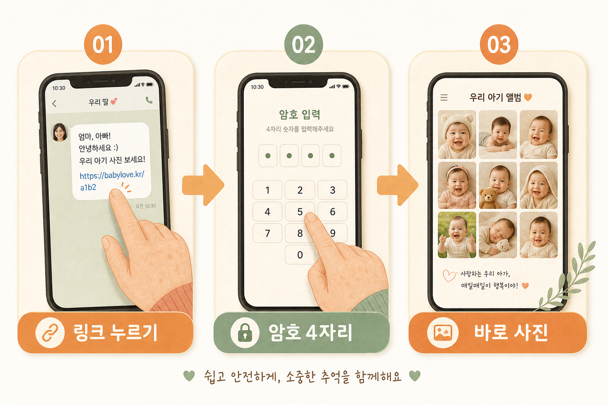

<div align="center">


# 까꿍 (kkakkung) 🍼

**아기 사진을 부모가 한 번 올리면,
조부모님이 앱 설치도 회원가입도 없이 링크 하나로 보는 가족 전용 사진첩.**




</div>

> ℹ️ 서비스 이름은 **까꿍**, 코드 저장소·폴더 이름은 `photo_heaven`입니다. (같은 프로젝트예요.)
>
> 🔒 이 저장소에는 **어떤 가족의 실제 링크·암호·사진도 들어있지 않습니다.** 각자 설치해서 자기 저장소에 담습니다.

---

## 목차

- [왜 만들었나](#왜-만들었나)
- [한눈에 보는 사용 흐름](#한눈에-보는-사용-흐름)
- [주요 기능](#주요-기능)
- [기술 스택](#기술-스택)
- [직접 설치하기 (self-host)](#직접-설치하기-self-host)
- [보안·프라이버시](#보안프라이버시)
- [로드맵](#로드맵)
- [라이선스](#라이선스)

---

## 왜 만들었나

카톡으로 아기 사진을 공유하면 — 부모는 매번 양가에 따로 보내야 하고, 조부모님은 **앱 설치·회원가입**이라는 벽에 부딪힙니다. 사진은 채팅방 여기저기 흩어져 나중엔 찾을 수도 없죠.

**까꿍**은 이걸 **딱 하나로** 해결합니다 — 조부모님은 **링크를 누르고, 이름 한 번 고르면 끝.** 앱도, 회원가입도, 비밀번호 로그인도 없습니다.

그래서 이 프로젝트는 "기능이 많은 것"이 아니라 **"할머니·할아버지가 쓸 수 있는 것"**을 목표로 합니다. 큰 글씨, 고대비, 오른손 엄지에 안 걸리는 버튼, 쉬운 말투 — 이런 게 핵심 경쟁력입니다.

이미 있는 앱들과 비교하면:

| | 앱 없이 링크로 열람 | 원본 화질 | 조부모 친화 UX | 오픈소스·내 저장소 |
|---|:---:|:---:|:---:|:---:|
| 패밀리앨범 (국내 최다) | ❌ 전원 앱 설치 | ❌ 무료판 압축 | 보통 | ❌ |
| Clann (상용) | ⭕ | ⭕ | 보통 | ❌ 남의 서버 |
| Immich (오픈소스) | ⭕ | ⭕ | ❌ 기술자용 | ⭕ |
| **까꿍** | ⭕ | ⭕ | ⭕ **최우선** | ⭕ |

> Immich·PhotoPrism 같은 훌륭한 오픈소스 사진 앱이 이미 많습니다. 까꿍은 그들과 경쟁하지 않습니다 — **"기술 모르는 조부모가 손주 사진을 보는 것"**이라는 좁고 명확한 자리를 노립니다.

---

## 한눈에 보는 사용 흐름

**조부모(보는 사람)**
> 문자로 받은 링크 탭 → 암호 4자리(처음 한 번) → 이름 고르기 → **바로 사진.** 끝.

**부모(관리하는 사람)**
> 관리 화면에서 사진·영상 올리기 → 가족이 보고 하트·한마디 → 밖에 자랑 → 컴퓨터로 백업.

---

## 주요 기능

<div align="center">

</div>

### 👵 조부모 — 보는 사람

- **링크 + 암호 4자리**로 열람 (한 번 넣으면 폰이 30일 기억, 볼 때마다 갱신)
- **"누구세요?"** 이름 한 번 고르면 신원 완료 — 로그인 없음 (누가 봤는지도 표시)
- **날짜별 스크랩북** 배치 · 두 아이 이름 필터 · "태어난 지 N개월" 나이 라벨
- **📅 달력 뷰** — 날짜별로 사진을 모아보고, 날짜를 누르면 그날 사진 크게보기
- **크게 보기** — 이전/다음 넘기기, **전체화면 자동 슬라이드쇼**, 더블탭 확대, 좌우 스와이프
- **🎬 영상 재생** — 사진과 함께 짧은 영상도 (▶ 아이콘, 탭하면 재생)
- **❤️ 하트 원탭 반응** (누르면 '통' 튀는 애니메이션) · 사진마다 **한마디(댓글)**
- **📲 자랑하기** — 버튼 하나로 문자·카카오톡·페이스북·인스타그램에 사진 공유
- **즐겨찾기만 보기 + 연도/월 검색 + 메모 검색**
- **원본 화질 저장**(다운로드)
- **🏠 홈 화면 바로가기** — 버튼 하나로 홈 화면에 아이콘 설치 (안드로이드 원터치 / 아이폰 안내)
- **글자 크게 3단계 + 고대비 모드** (노안 배려)

### 👨‍👩‍👧 부모 — 관리하는 사람

- **사진·영상 업로드** — 원본 보관 + 축소본 자동 생성, EXIF 촬영일 자동, 아이 지정
- **🎭 감정 일기** — 사진마다 "오늘 기분"(행복·사랑·졸림 등)을 골라 메모 앞에 기록
- **✏️ 앨범 이름 직접 설정** — "준영이네", "우리 가족" 등 원하는 이름으로
- **💾 백업** — 전체 / 연도별 / 아이별로 원본을 ZIP 다운로드 (컴퓨터 전용)
- 아이·가족·사진 등록/수정/삭제 — 섹션은 **접이식(토글)**로 깔끔하게
- **표지 사진 직접 고르기**, 옛날 스캔 사진용 날짜 수동 지정
- **사진 휴지통** (삭제 → 되살리기 → 완전삭제 → 휴지통 비우기, 확인창)
- **'가족 화면 미리보기'** — 관리 화면에서 조부모가 보는 화면을 그대로 확인
- 공유 링크 재생성(유출 대비) · 링크 만료 설정 · 다운로드 켜기/끄기
- 최근 사진 **페이지 나누기**(사진이 많아져도 목록이 안 길어짐)

### 🔒 공통

- **검색엔진 완전 차단** — 아기 사진이 검색에 절대 안 뜸 (`robots` + `noindex` + 헤더)
- 사진은 **비공개 저장소**에 **서명된 임시 주소**로만 열람
- 새로고침해도 스크롤 위치 유지 · 앱 아이콘(까꿍 웃는 얼굴)

---

## 기술 스택

| 영역 | 사용 기술 |
|---|---|
| 프론트/백 | **Next.js 15** (App Router, TypeScript) · React 19 |
| 데이터베이스 | **Supabase** (PostgreSQL) |
| 사진·영상 저장 | **Cloudflare R2** (나가는 트래픽 무료) |
| 배포 | **Vercel** — 함수 실행 지역 서울(`icn1`) |
| 스타일 | **Tailwind CSS** (따뜻한 살구·세이지 팔레트) |
| 인증 | **없음** — 앨범 암호(bcrypt 해시) + 서명된 쿠키(JWT) |
| 공유 | Web Share API (사진은 서버 프록시로 받아 CORS 우회) |
| 백업 | `client-zip` (브라우저에서 순차 스트리밍 압축) |

> 로그인·회원가입 시스템이 **없습니다.** 그게 이 제품의 존재 이유입니다.

---

## 직접 설치하기 (self-host)

> ⚠️ 이 프로젝트는 **개발자용 self-host**입니다. Supabase·Cloudflare R2·Vercel 계정과 기본적인 배포 지식이 필요해요. (비개발자를 위한 원클릭 설치는 제공하지 않습니다.)

1. **Supabase** 프로젝트 생성 → SQL Editor에서 `supabase/schema.sql` 및 이후 마이그레이션(`002_…`~`005_…`) 실행
2. **Cloudflare R2** 비공개 버킷 생성 + API 토큰 발급
3. `.env.example`을 복사해 `.env.local`에 값 입력 (아래 참고)
4. `npm install && npm run dev` → `http://localhost:3000/admin/setup`에서 첫 앨범 생성
5. **Vercel**에 GitHub 저장소 연결 + 같은 환경변수 입력 → 배포 (함수 지역은 `vercel.json`)
6. 배포 주소를 R2 버킷 CORS 허용 주소에 추가 (`r2-cors.json` 참고 — 본인 배포 주소로 바꾸세요)

필요한 환경변수(값은 각자 발급):

```bash
NEXT_PUBLIC_SUPABASE_URL      # Supabase 프로젝트 URL
SUPABASE_SERVICE_ROLE_KEY     # Supabase service_role 키 (서버 전용, 절대 공개 금지)
R2_ACCOUNT_ID
R2_ACCESS_KEY_ID
R2_SECRET_ACCESS_KEY
R2_BUCKET
SESSION_SECRET                # 쿠키 서명용 긴 무작위 문자열
INITIAL_SETUP_KEY             # 첫 앨범 생성 1회용 열쇠 (만든 뒤 비우기)
```

---

## 보안·프라이버시

이 앱은 **아기 사진**을 다룹니다. 프라이버시를 최우선으로 설계했어요.

- **비밀은 오직 `.env.local`에.** 코드·문서·커밋에 API 키나 가족 정보를 넣지 않습니다.
- **가족의 비밀 링크(`/a/...`)와 암호는 이 저장소 어디에도 없습니다.** 각 설치본이 따로 만듭니다.
- 앨범 암호는 **bcrypt로 해시** 저장 — 원문 복구 불가.
- R2 버킷은 반드시 **비공개**로. 사진은 서명된 임시 URL로만 열립니다.
- 모든 페이지 **검색엔진 차단**(`robots.txt` + `noindex` + 헤더).
- 공유(자랑하기)는 **사진 파일만** 나가고 비밀 링크는 실리지 않습니다.

---

## 로드맵

- **✅ Phase 1 — 기반:** 업로드 · 링크 열람 · 한마디 · 하트 · 두 아이 · 휴지통 · 접근성 · 표지 · 미리보기 · 성능 개선
- **✅ Phase 2 — 확장:** 영상 업로드·재생 · 감정 일기 · 달력 뷰 · 자랑하기(SNS 공유) · 홈 화면 바로가기(PWA) · 백업(ZIP) · 앨범 이름 설정 · 감정별 모아보기 · 여러 아이 동시 태그
- **⬜ Phase 3 — 예정:** 새 사진 올라오면 알림 (문자 / 카카오)

---

## 라이선스

[MIT](LICENSE) — 자유롭게 쓰고, 고치고, 배포하세요. 다만 **가족의 프라이버시를 존중**해주세요. 🐣
